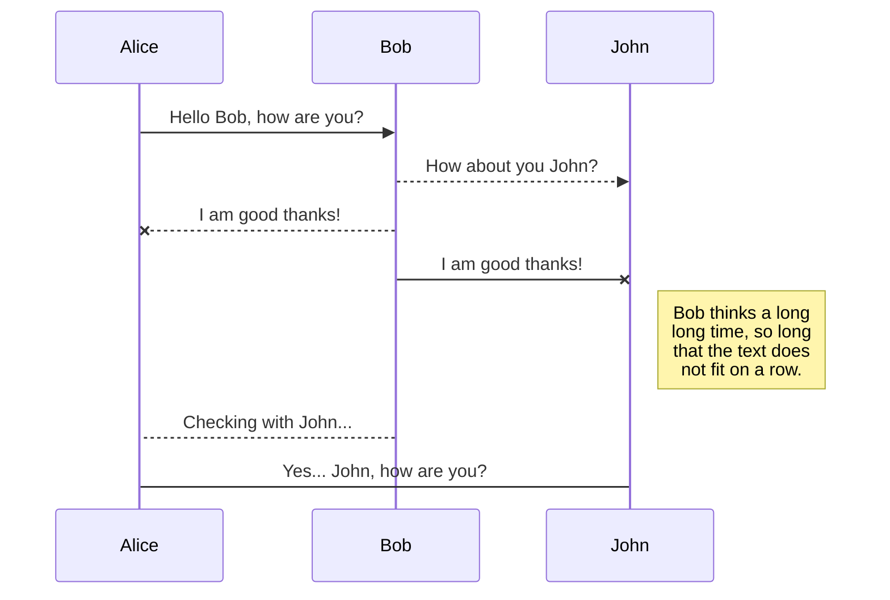

# TURTLEBOT LOCALIZATION AND NAVIGATION USING ROS !

The repository contain the work done as part of the Robotics module For master in computer vision and robotics " VIBOT " , The Repository contain two diffrent methods for autonomous  robots Localization and Navigation , [behavior_based](https://github.com/ElJAZRY/ROS_PROJECT/tree/master/behavior_based "behavior_based") and [map_based](https://github.com/ElJAZRY/ROS_PROJECT/tree/master/map_based "map_based") , the two method represent diffrent approaches to the problem of autonomous robots Localization and Navigation , and compination of both to get the benefits of both methods 


# Files


## SmartyPants

SmartyPants converts ASCII punctuation characters into "smart" typographic punctuation HTML entities. For example:

|                |ASCII                          |HTML                         |
|----------------|-------------------------------|-----------------------------|
|Single backticks|`'Isn't this fun?'`            |'Isn't this fun?'            |
|Quotes          |`"Isn't this fun?"`            |"Isn't this fun?"            |
|Dashes          |`-- is en-dash, --- is em-dash`|-- is en-dash, --- is em-dash|




And this will produce a flow chart:

```mermaid
graph LR
A[Square Rect] -- Link text --> B((Circle))
A --> C(Round Rect)
B --> D{Rhombus}
C --> D
```

